## 节点、树的属性描述
    属性:             
        节点的层次(深度)  -- 从上往下数
        节点的高度 -- 从下往上数
        树的高度 -- 总共有几层
        节点的度 -- 有几个孩子
        树的度 -- 各节点的最大值
        有序树 -- 从逻辑上看，树中结点的各子树从左至右是有次序的，不能互换。
        无序树 -- 从逻辑上看，树中结点的各子树从左至右是无次序的，可以互换。
## 森林
     森林是m(m>0) 棵互不相交的树的集合

## 树的常考性质
#### 结点数 = 总度数 + 1
#### 度为m的树和m叉树之间的区别
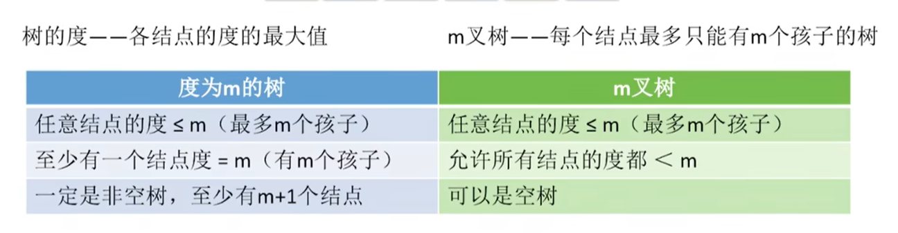

#### 度为m的树第i层至多有m^i-1个节点
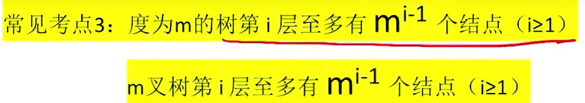
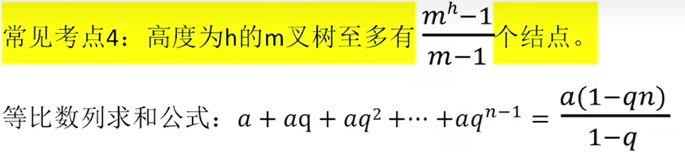
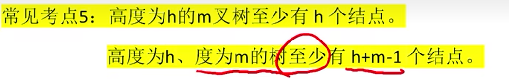
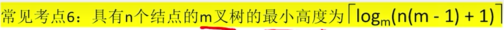

### 几个特殊的二叉树
    满二叉树
    完全二叉树
    二叉排序树
        ·左子树上所有的节点的关键字都小 根节点的关键字
        ·右子树上所有节点的关键字都大于根节点上的关键字
    平衡二叉树
        ·书上任意结点的左子树和右子树的深度之差不超过1.

### 二叉树的性质
**1、叶子结点比二叉分支节点多一个**
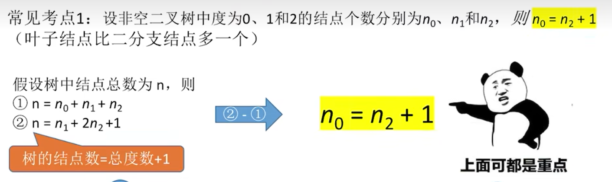
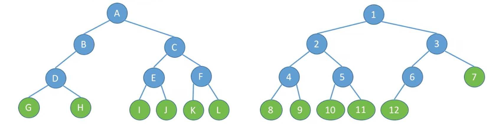
**2、二叉树第i层至多有2^i-1个结点**
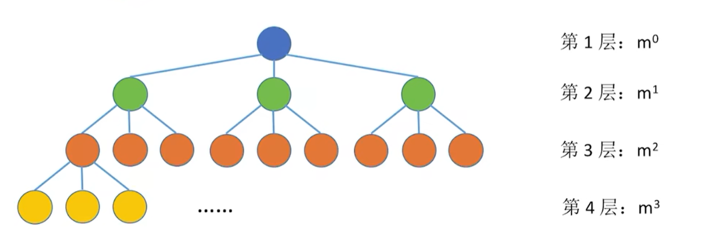
**3、高度为h的二叉树至多有2^h-1个结点(满二叉树)**

**4、具有n个结点的完全二叉树的高度为：**
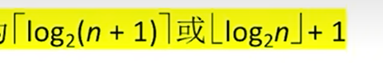**或者**
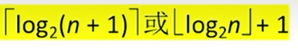**可以推出**
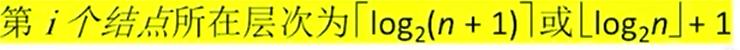
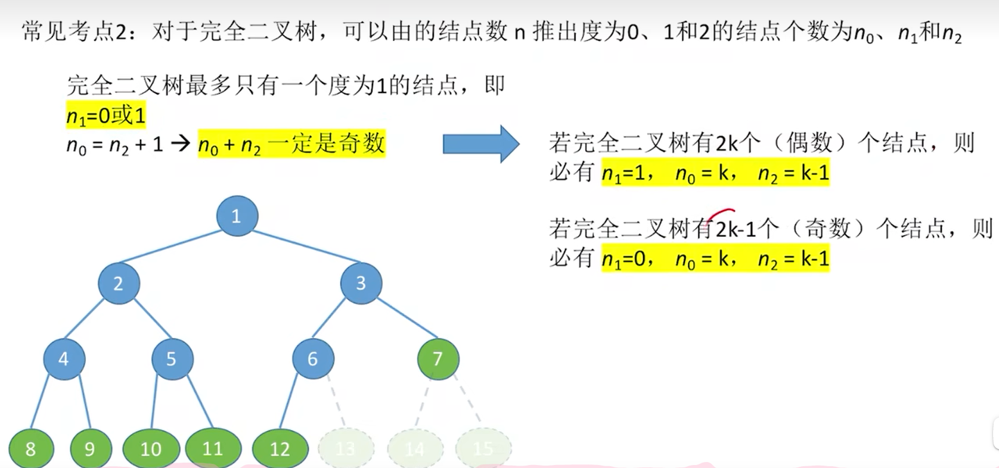

### 二叉树的顺序存储结构
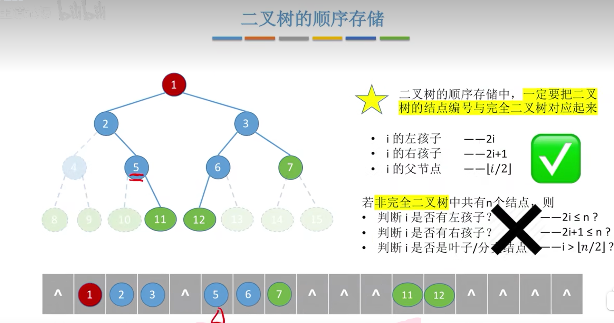
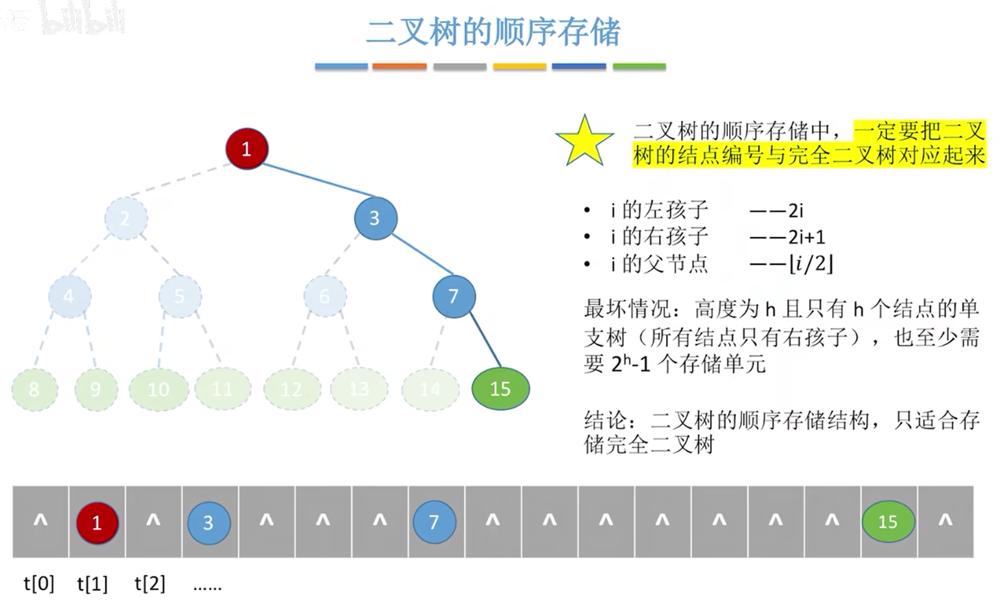
**结论：可以看到有大量的空间是浪费的，故顺序结构只适合存储完全二叉树** 

### 二叉树的链式存储结构
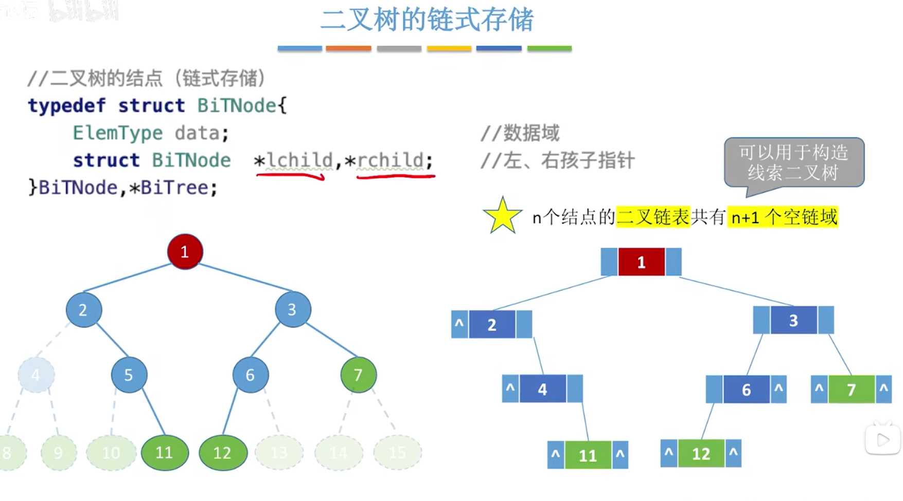

### 二叉树的层序遍历
    算法思想：
    1、初始化一个队列
    2、根节点入队
    3、若队列非空，则对头结点出队，访问该节点，并将其左右孩子入队
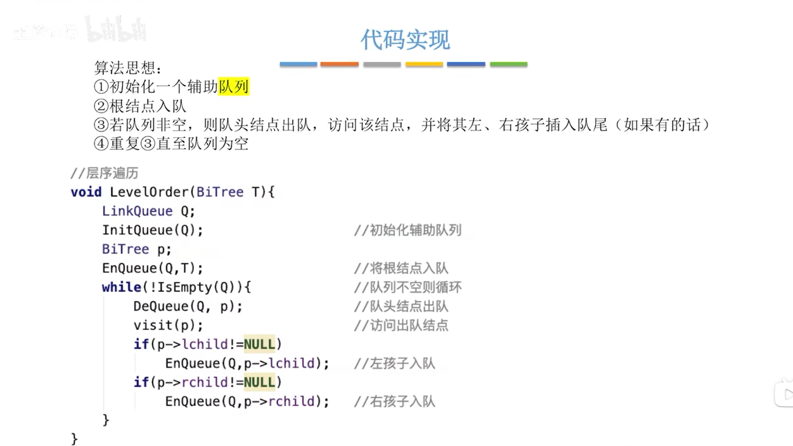

### 由遍历序列来构建二叉树
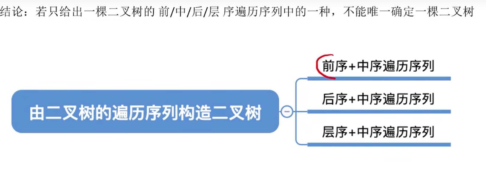
**方法**
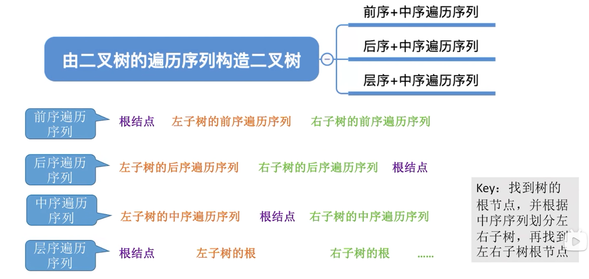

### 线索二叉树的存储结构
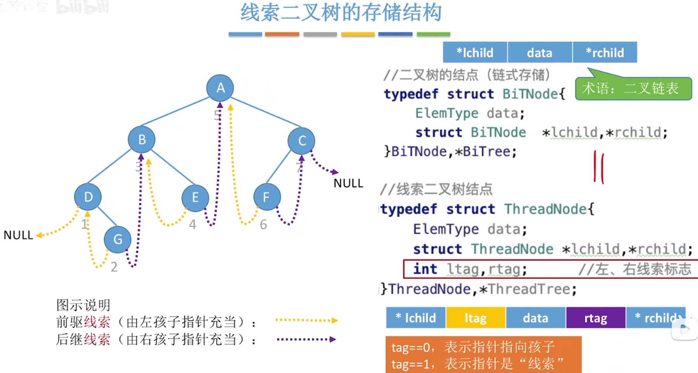

### 三种线索二叉树的对比
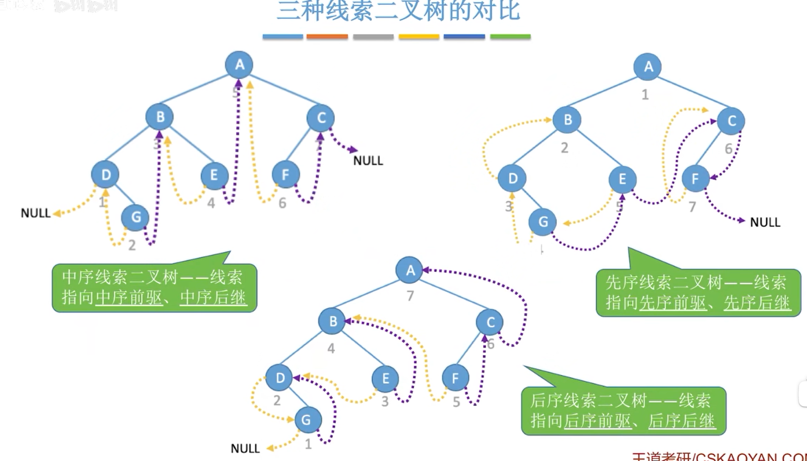

### 线索二叉树的总结
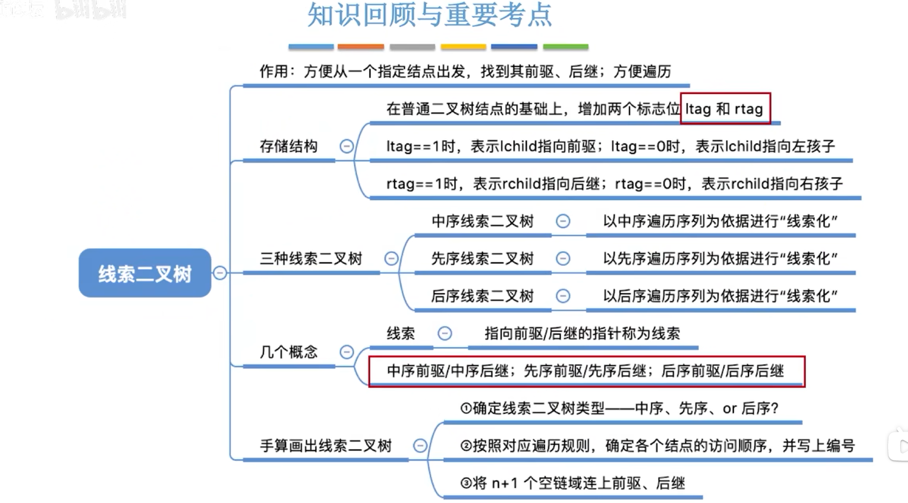

