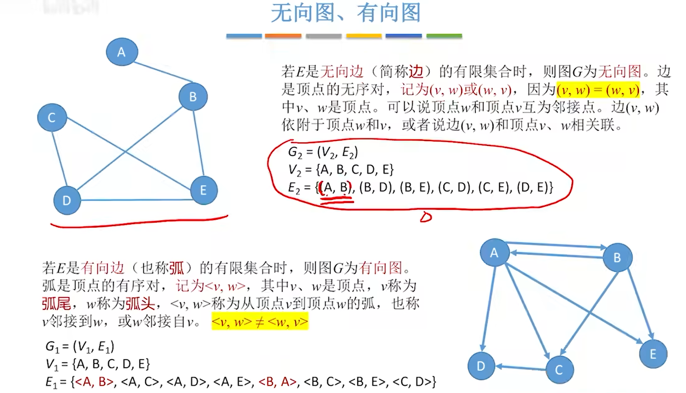
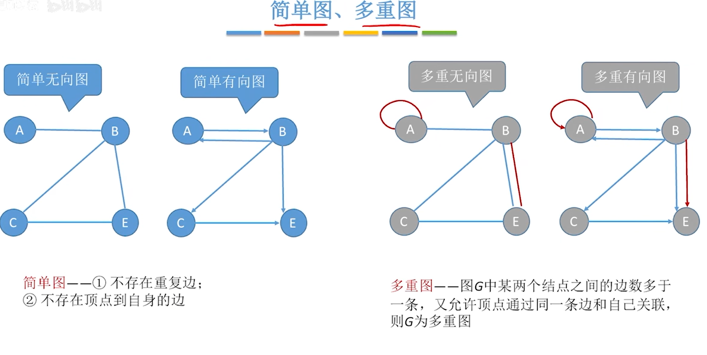
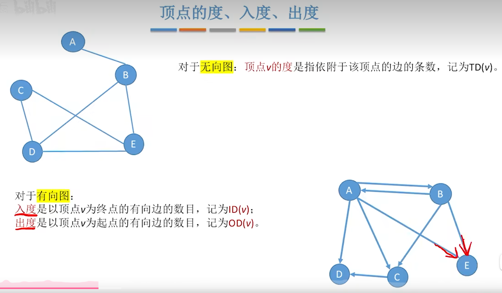
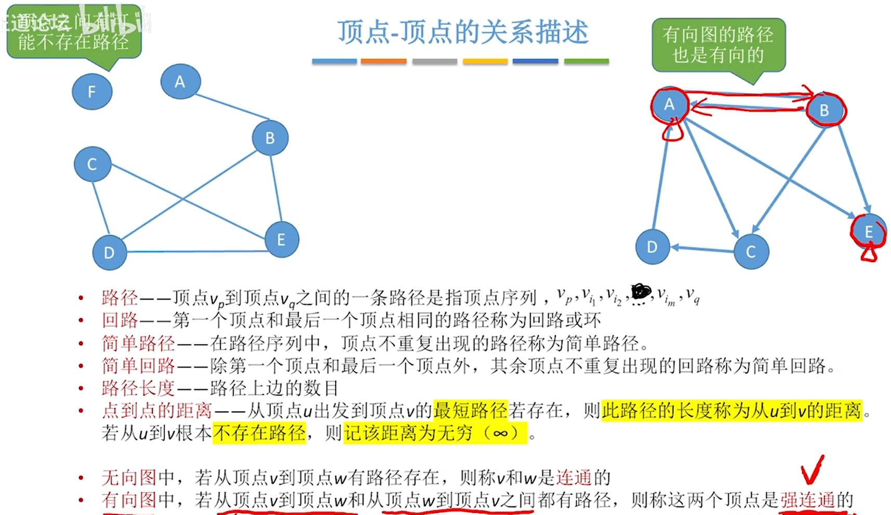
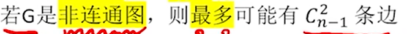
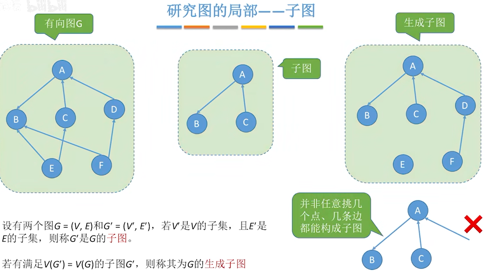

### 图的定义
    图由顶点集和边集组成，记为G = (V,E), 其中V表示图G中顶点的有限非空集；
        E表示顶点之间的关系即边集
    注意：线性表可以是空表，树可以是空树，但是图不可以是空图，V一定是非空集即一个图可以只有顶点可以没有边

### 有向图和无向图

### 简单图和多重图

    简单图：1、不存在重复边
           2、不存在顶点到自身的边
    多重图：1、可以存在重复边
           2、可以存在顶点到自身的边

### 顶点的度、入度、出度

    对于无向图：顶点的度是指依附于该顶点的边的条数，记为TD

    对于有向图：（e为图的边数）
        入度是以顶点V为终点的有向边的条数，记为ID TD和 = 2e
        出度是以顶点V为起点的有向边的条数，记为OD 则TD和 = ID + OD =e

### 顶点和顶点之间的关系描述

    对于n个顶点的无向图G，若G是连通图，则最少有n-1条边

    对于n个顶点的有向图G若G是强连通图则至少有n条边

### 子图
