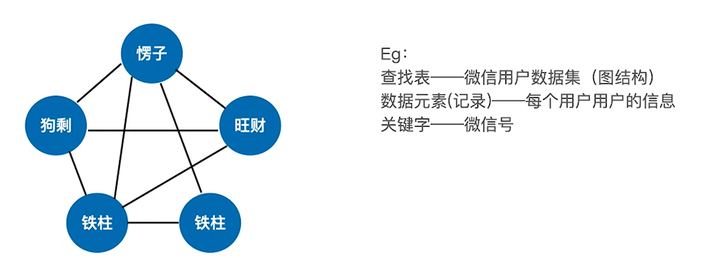
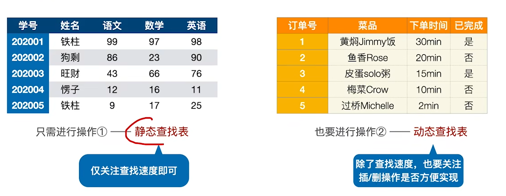
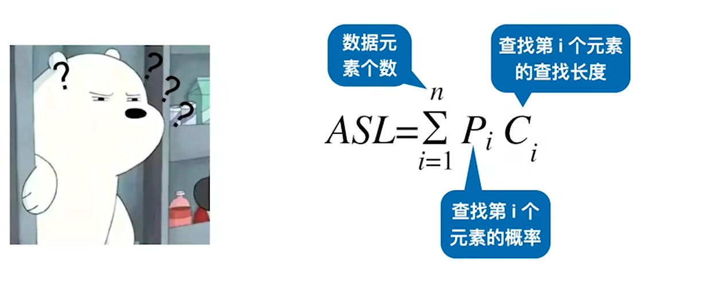

## 查找的基本概念
    查找———— 在数据集合中寻找满足某种条件 数据元素的过程
    查找表———— 用于查找的数据集合称为查找表，它由同一类型的数据元素组成
    关键字(主键)———— 数据元素中唯一表示该元素的某个数据项的值，使用基于关键字的查找，查找结果应该是唯一的。

### 对查找表的常见操作
    1、查找符合条件的数据元素
    2、插入删除某个数据元素

### 查找算法的评价指标
    查找长度———— 在查找运算中，需要对比关键字的次数成为查找长度
    平均查找长度———— 所有的查找过程中进行的关键字比较次数的平均值
平均查找长度
