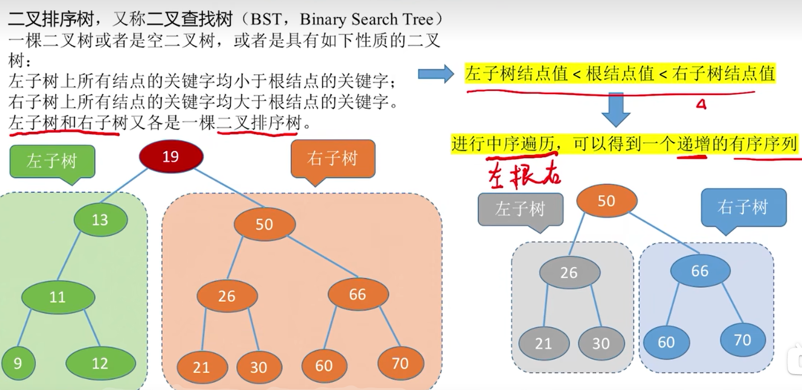
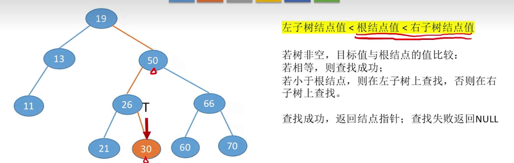
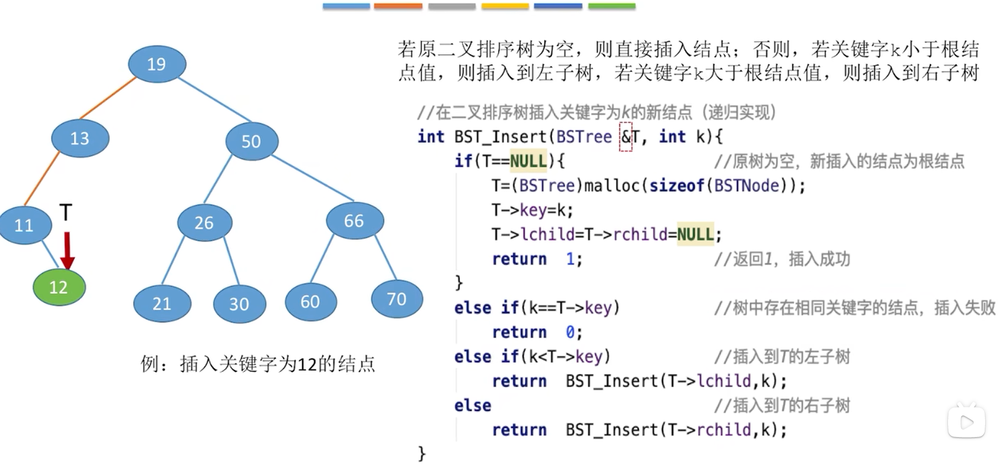
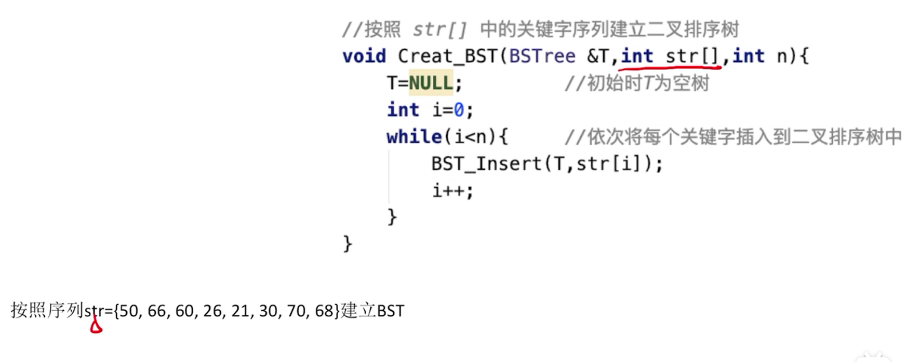
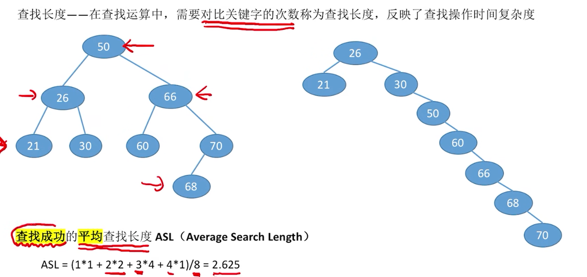
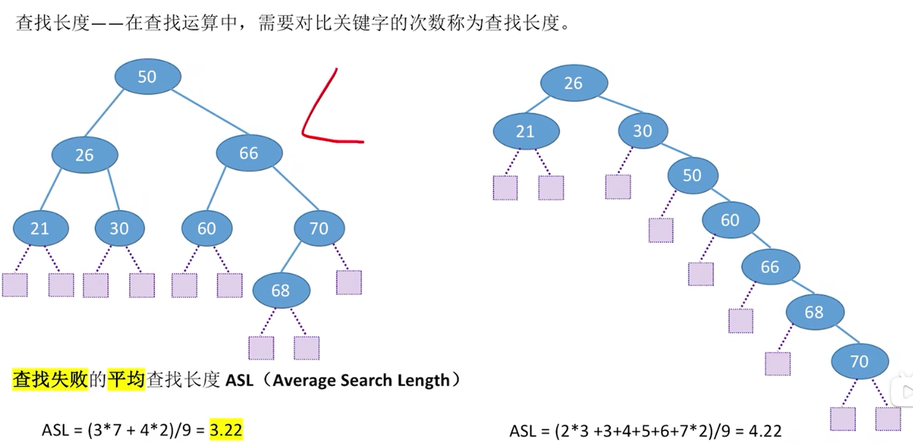
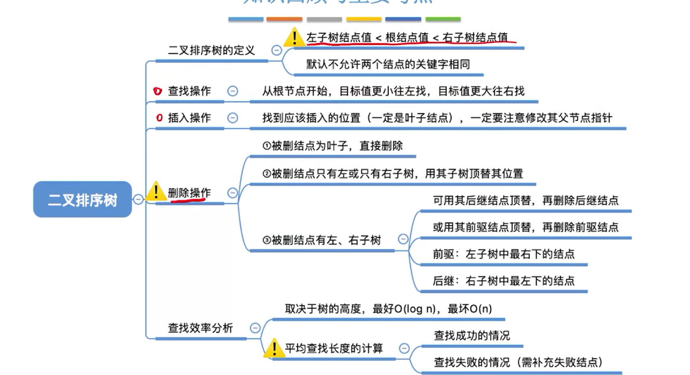

## 二叉排序树

### 二叉排序树的查找

### 二叉排序树的插入
 新插入的新节点一定是叶子节点
### 二叉排序树的构造

### 二叉树结点的删除
    1、若删除的结点z是叶子结点，则直接删除，不会破环二叉树的性质。
    2、若结点z只有一棵左子树或右子树，则让z的子树成为z父节点的子树，代替z的位置。
    3、若结点z有左右两棵子树，则令z的直接后继(或直接前驱)
    即z右子树的最右下结点(最小的值)或者左子树的最右下的值(最大的值)代替z，然后从二叉排序树中删去这个直接后继(或直接前驱)，这样就转化成了第一种或第二种情况。

### 平均查找长度
查找成功

查找失败

### 总结
